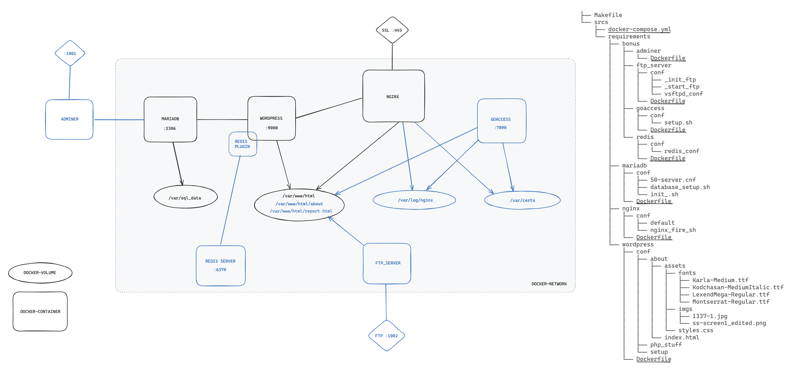

# *`Inception`*

####  Graph explaining the structure of the project:

<a href="https://excalidraw.com/#json=qSE4mp02gFfg79sjcFiyA,Wo5G3CjQBAQ-DqGptgbe5w">link</a>
```
https://excalidraw.com/#json=qSE4mp02gFfg79sjcFiyA,Wo5G3CjQBAQ-DqGptgbe5w
```

```
./inception_graph.excalidraw
```

<div align="center" width="100%">
  
</div>


#### The School Subject of the project:

```
./project-subject.pdf
```

#### Run

clone this repo and cd to it
```
git clone https://github.com/beddinao/Inception.git && cd Inception
```

run the project with a single command
```
make
```
