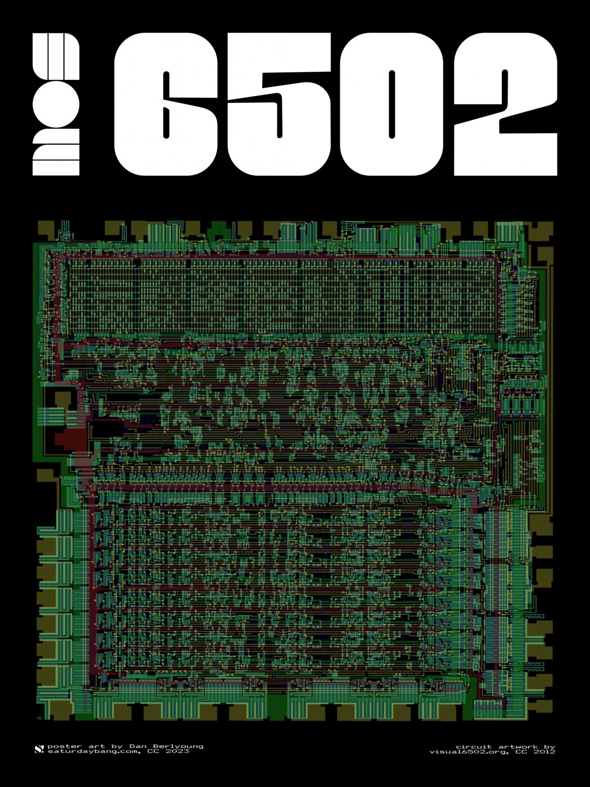
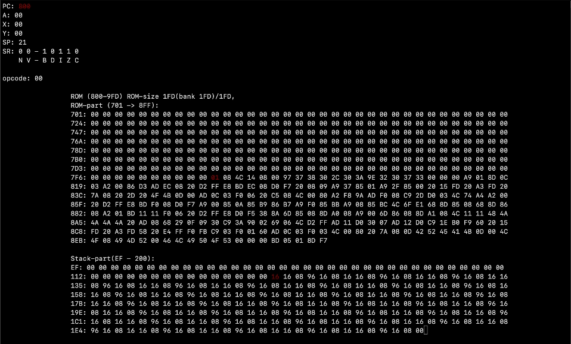

# *`MOS-6502-Emulator`*

<!--div align="center" width="100%" >
  
</div-->
An instruction-accurate <a href="https://en.wikipedia.org/wiki/MOS_Technology_6502">6502 CPU</a> emulator written in C, designed for integration into larger systems.<br>
The 6502 and its derivatives powered systems like the <a href="https://en.wikipedia.org/wiki/Commodore_64">Commodore 64</a>, <a href="https://en.wikipedia.org/wiki/Nintendo_Entertainment_System">Nintendo Entertainment System (NES)</a>, Apple II, BBC Micro.<br>

## features
This emulator uses a jump-table design,<br>
where the opcode value (e.g., 0x80) directly indexes a function pointer table.<br>
Each entry in the table points to a function that replicates the behavior of the corresponding 6502 instruction.

Binary Coded Decimal (BCD) mode is fully supported, along with all 13 addressing modes:

```
IMPLIED
IMMEDIATE
ACCUMULATOR
ABSOLUTE
ZERO PAGE
INDEXED-X ABSOLUTE
INDEXED-Y ABSOLUTE
INDEXED-X ZERO PAGE
INDEXED-Y ZERO PAGE
ABSOLUTE INDIRECT
INDEXED-X INDIRECT
INDEXED-Y INDIRECT
RELATIVE
```

The emulator fully implements all 151 official opcodes of the 6502.<br>
The 8-bit opcode design allows for 256 possible values, but many are "illegal opcodes." <br>
These undocumented instructions perform unexpected or unconventional operations,<br>
such as modifying multiple registers or combining valid opcodes.<br>

Illegal opcodes are not implemented, and executing them will only increments the PC by the OP size.

## main loop
classic fetch-decode-execute cycle:
```c
while (1)
{
  // fetch
  mos6502->opcode = bus->read(ram, mos6502->PC);

  // decode - execute
  mos6502->cycles = mos6502->opcodes[mos6502->opcode](mos6502);
}
```
- Fetch: The next opcode is retrieved from memory at the program counter (PC).
- Decode: The opcode is used as an index in the opcode table (function pointer array).
- Execute: The indexed function is called, performing the 6502 instruction and returning the number of cycles it takes.

## integration
This emulator is designed to be integrated into larger systems emulating machines that use the 6502 processor,<br>
such as the Commodore 64, NES, Atari, or Apple II.<br>

- dedicated "production" branch, which excludes visualization features.
- bus implementation to connect the CPU with RAM, ROM, and other devices.

```c
typedef	struct _bus {
  uint8_t     ram[ADDR_RANGE];
  uint8_t     rom[ADDR_RANGE];
  // bank switching logic .. 
  // methods ..
  // other devices ..
}	_bus;

```

## visualisation
The main branch has a dedicated thread to run the visualization using the <a href="https://en.wikipedia.org/wiki/Ncurses">ncurses</a> library,<br>
allowing for real-time observation of the CPU behavior
<div align="center">
  
</div>

```
• PC.
• Accumulator (A).
• Index registers (X/A).
• Stack pointer (SP).
• Status register 8-bit (each bit represents a flag).
• last executed opcode.
• Memory dumps:
  • PC surrounding area: hex dump of memory from PC - 0xFF to PC + 0xFF.
  • SP Surrounding Area: Displays memory from SP - 0x32 to a fixed address (0x200).
```

## upcoming features
- full illegal opcodes implementation (partial progress)
- decimal mode support (now added)
